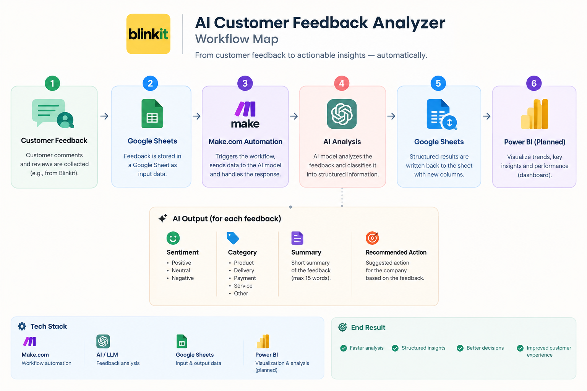
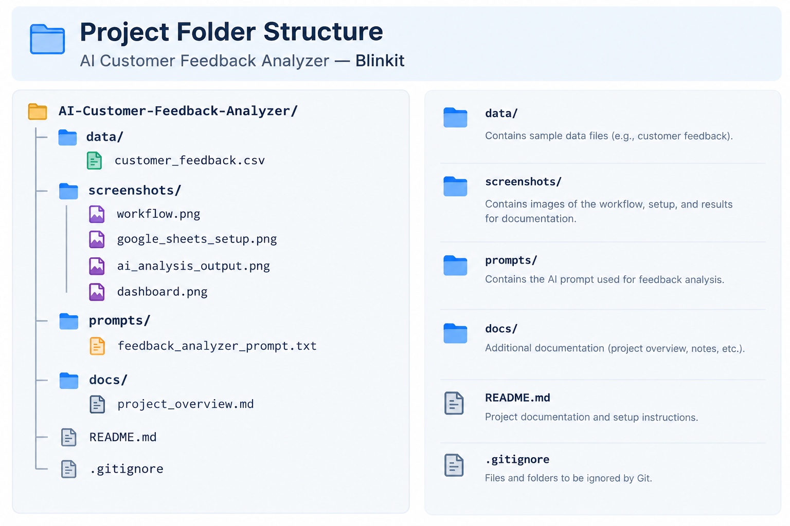

# 🤖 AI Customer Feedback Analyzer — Blinkit

An AI-powered automation project that analyzes customer feedback and converts unstructured comments into structured, actionable insights.

## 📌 Overview

I built this project to explore how AI and automation can be combined to solve a practical business problem.

The idea is simple: instead of manually going through every customer complaint or review, an AI model analyzes the feedback automatically and identifies the customer's sentiment, the type of issue, a short summary, and a recommended action.

The workflow is automated using Make.com, with Google Sheets used to store the feedback and results.

## 🎯 Objectives

The main objectives of this project are to:

Automate customer feedback analysis
Identify customer sentiment
Categorize different types of issues
Generate concise feedback summaries
Suggest actions based on customer complaints
Understand how AI can be integrated into business workflows

## 🔄 Workflow

## 🧠 What the AI Analyzes

For every customer feedback entry, the AI generates four outputs:

1. Sentiment- Classifies feedback as:
               Positive,
               Neutral,
               Negative,

2. Category - Identifies the main issue:
                  Product,
                  Delivery,
                  Payment,
                  Service and
                  Other
3. Summary - Creates a short summary of the customer's feedback with a maximum of 15 words.

4. Recommended Action- Suggests one practical action that the company could take based on the feedback.

## 🛠️ Tech Stack

| **Technology**    | **Purpose**                        |
| ----------------- | ---------------------------------- |
| **Make.com**      | Workflow automation                |
| **AI / LLM**      | Customer feedback analysis         |
| **Google Sheets** | Input and output data storage      |
| **Power BI**      | Planned visualization and analysis |

🧪 Example
Customer Feedback

"My order arrived very late and two items were missing. This was a really disappointing experience."

AI Output
Sentiment: Negative
Category: Delivery
Summary: Order arrived late with two missing items.
Recommended Action: Investigate the delivery issue and resolve the missing items.

## 📊 Google Sheets Structure

The input and output data is organized into columns such as:

**Customer	Feedback	Sentiment	Category	Summary	Recommended Action**
Rahul	Order arrived late...	Negative	Delivery	Late order with missing items.	Investigate delivery issue.
Priya	Delivery was very fast.	Positive	Delivery	Customer praised fast delivery.	Maintain delivery performance.
💡 What I Learned

Building this project helped me understand how AI can be used beyond chatbots and content generation.

Some of the key things I learned:

Building AI-powered automation workflows
Connecting Google Sheets with Make.com
Using prompts to guide an LLM
Mapping data between automation modules
Structuring AI-generated outputs
Using AI for sentiment and text classification
Turning unstructured feedback into business-friendly information

🚀 Future Improvements

I plan to extend the project with:

 Priority detection — Low / Medium / High
 Automated alerts for high-priority complaints
 Sentiment trend analysis
 More detailed issue classification
 Power BI customer feedback dashboard
 Automated customer-support responses
 Feedback volume and category monitoring
 
## 📁 Project Structure

    
## 🎓 Project Purpose

The AI Customer Feedback Analyzer is a production-oriented automation designed to streamline the analysis of customer feedback.

The system automatically captures customer feedback, uses an AI model to analyze and classify each response, and stores structured insights for further action.

It helps businesses quickly identify customer sentiment, understand recurring issues, summarize feedback, and determine the appropriate action—reducing manual analysis and enabling faster response to customer concerns.

**Key Outcomes**

⚡ Automates customer feedback analysis

🤖 Uses AI for sentiment and issue classification

📊 Converts unstructured feedback into structured business data

🚨 Helps identify negative and high-impact customer issues

🎯 Generates actionable recommendations

🔄 Creates a scalable, repeatable feedback-analysis workflow

📈 Provides data that can be used for reporting and business intelligence

👤 Author

Twinkle Grover

Exploring AI Engineering, AI Automation, Data Analytics & Generative AI.
